<p align="center">
  
</p>

<p align="center">
  <strong>Topia — internal skill toolkit for AI coding assistants.</strong><br>
  65 skills · 203 connections · 44 signals · 10 extension packs · optional persistent memory via agora-code MCP
</p>

<p align="center">
  <strong>Claude Code</strong> (native) · <strong>Cursor</strong> · <strong>Antigravity</strong> · <strong>Codex</strong> · <strong>OpenCode</strong> · <strong>OpenClaw</strong>
</p>

---

## What Topia is

AI coding agents are smart but undisciplined. They skip steps, forget context across sessions, and ship code that "looks done." Topia gives them workflow rails the model can't skip:

- **Plan before code** — `idea` elicits requirements, `plan` writes phase files, `adversary` red-teams the plan, all before a line of code.
- **Tests before commits** — `test` writes failing tests first (red), `fix` implements until green. TDD enforced, not suggested.
- **Hooks block bad work** — `sentinel` (secrets, OWASP), `preflight` (logic, regressions), `completion-gate` (validates agent claims have evidence). Auto-fire on tool use.
- **Memory survives sessions** — `journal` persists ADRs to `.topia/`, optional [agora-code MCP](mcp-servers/agora-code/README.md) adds SQLite-backed semantic recall across sessions.

One source of truth (`skills/`) compiles to six IDE rule formats — switch IDEs without rewriting your workflow rules.

---

## Install

```bash
git clone https://github.com/protopia/skill-topia.git ~/.claude/skills/skill-topia
cd ~/.claude/skills/skill-topia
npm install
claude plugin add .
node compiler/bin/topia.js setup --global --preset gentle
```

The final command wires `preflight`, `sentinel`, `completion-gate`, and `quarantine` as native Claude Code hooks. Verify with:

```bash
node compiler/bin/topia.js doctor
# ✓ 65 skills, 203 connections, 44 signals — mesh is healthy
```

### Non-Claude IDEs

```bash
node compiler/bin/topia.js init --platform cursor       # also: codex, antigravity, opencode, openclaw, generic
```

Compiles all 65 skills to the target IDE's rule format.

### Optional: persistent memory (agora-code MCP)

```bash
pip install ./mcp-servers/agora-code   # requires Python 3.10+
```

Then register in your project's `.mcp.json`:

```json
{ "mcpServers": { "agora-memory": { "command": "agora-code", "args": ["memory-server"] } } }
```

Four skills (`journal`, `build`, `idea`, `neural-memory`) detect this MCP automatically and route recall / learning through it. Skip it and Topia falls back to file-based `.topia/` persistence. Full integration details: [`docs/mcp-integrations/agora-code.md`](docs/mcp-integrations/agora-code.md). Upstream README (vendored verbatim): [`mcp-servers/agora-code/README.md`](mcp-servers/agora-code/README.md).

> **Do NOT** run `agora-code install-hooks --claude-code`. Topia's hooks are canonical — running both installers produces a fragile dual-owner hook chain. See the integration doc for the full rationale.

### Coming from rune-kit?

If your project already has a `.rune/` directory, Topia's session-start hook will prompt you to migrate it. Or run explicitly:

```bash
node compiler/bin/topia.js migrate-from-rune --dry-run    # preview
node compiler/bin/topia.js migrate-from-rune              # interactive
```

This copies `.rune/` state files (decisions, ADRs, conventions, learnings) into `.topia/` and renames `~/.claude/plugins/cache/rune-kit/` → `.disabled` so the two plugins stop fighting over skill names. Reversible: see [`docs/migration/from-rune.md`](docs/migration/from-rune.md).

---

## Use

Every skill is invoked as `/topia <name>`. The router picks the right skill from a natural description of what you want done.

```bash
/topia onboard                # generate CLAUDE.md + .topia/ context for a new project
/topia build "add JWT auth"   # implement a feature (full TDD cycle)
/topia debug "login 401s"     # root-cause an issue
/topia rescue                 # refactor legacy code safely
/topia audit                  # 8-dimension project health check
/topia sentinel               # security scan before commit
/topia incident "503s"        # production incident response
/topia retro                  # engineering retrospective
```

The 8-step build flow (route → recall → plan → test → implement → gate → verify → persist+commit) is documented on the [landing page](docs/index.html). Concrete scenarios — "I just inherited this codebase," "production is down," "I want to steal a pattern from a GitHub repo" — live in the [Scenarios section](docs/index.html#scenarios).

---

## Skill catalog

### Core development & workflow
| Skill | Purpose |
|---|---|
| `build` | **L1 orchestrator** — full TDD cycle (Understand → Plan → Test → Implement → Verify → Commit). Default route for most code tasks. |
| `rescue` | **L1 orchestrator** — multi-session legacy refactor with safety nets. |
| `scaffold` | **L1 orchestrator** — bootstrap a new project from a description. |
| `team` | **L1 orchestrator** — decompose into parallel workstreams with worktree isolation. |
| `launch` | **L1 orchestrator** — deploy + verify + announce. |
| `fix` | Apply code changes from diagnosis or review findings. |
| `debug` | Root-cause analysis; hands off to `fix`. |
| `test` | TDD test writer — red first, green after. |
| `scout` | Fast read-only codebase scanner. |
| `verification` | Run lint + type-check + tests + build. |
| `db` | Migrations, rollbacks, query validation. |
| `git` | Semantic commits, PR bodies, branch naming. |
| `graft` | Port features from external GitHub repos. |
| `surgeon` | Incremental refactor (Strangler Fig, Branch by Abstraction). |
| `safeguard` | Characterization tests + rollback markers before risky refactors. |
| `improve-architecture` | Find friction; propose deepening opportunities. |
| `mcp-builder` | Generate MCP servers from spec. |

### Security, governance, infrastructure
| Skill | Purpose |
|---|---|
| `sentinel` | Pre-commit security gate — OWASP, secrets, deps. |
| `preflight` | Pre-commit quality gate — logic, regressions, completeness. |
| `sentinel-env` | OS + runtime + tools + ports + env-var check before work starts. |
| `sast` | Static-analysis wrapper (ESLint, Semgrep, Bandit, Clippy). |
| `adversary` | Pre-implementation red-team analysis on high-risk plans. |
| `logic-guardian` | Protects business logic from accidental deletion. |
| `quarantine` | Advisory on untrusted MCP / WebFetch / upload content. |
| `hallucination-guard` | Catch phantom imports, non-existent packages. |
| `deploy` | Multi-platform deploy with health checks. |
| `watchdog` | Post-deploy health monitoring. |
| `incident` | Production incident response (triage → contain → root-cause → postmortem). |
| `dependency-doctor` | Outdated packages + CVE scan + prioritized update plan. |
| `audit` | 8-dimension project health audit. |
| `perf` | Performance regression gate (N+1, sync-in-async, bundle bloat). |

### Knowledge, research, strategy
| Skill | Purpose |
|---|---|
| `research` | Web search for technologies + best practices. |
| `docs` | Auto-generate + maintain README, API, architecture docs. |
| `docs-seeker` | Locate API references, changelogs, migration guides. |
| `documentation` | Leadership-ready packages, user stories, Jira CSV. |
| `onboard` | Generate CLAUDE.md + .topia/ context for a new project. |
| `brainstorm` | Generate 2-3 approaches with trade-offs. |
| `design` | Design-system generator (palette, typography, anti-patterns). |
| `problem-solver` | 19 analytical frameworks + 12 bias detectors. |
| `sequential-thinking` | Multi-variable analysis with dependency ordering. |
| `journal` | ADRs, decisions, progress across sessions. |
| `neural-memory` | Cross-session recall via semantic graph (uses agora-code MCP when registered). |
| `trend-scout` | Market intelligence (Product Hunt, GitHub Trending, HN, Reddit). |
| `autopsy` | Health assessment of legacy codebases (rescue RECON). |
| `doc-processor` | Generate / parse PDF, DOCX, XLSX, PPTX, CSV. |

### Planning & management
| Skill | Purpose |
|---|---|
| `plan` | Master plan + phase files for multi-phase features. |
| `idea` | Requirements elicitation — 5-question gate, cross-session memory. |
| `review` | Code review with `file:line` findings. |
| `review-intake` | Process external PR comments / issue triage. |
| `retro` | Engineering retrospective on commit history. |
| `scope-guard` | Detect + quantify scope creep. |
| `context-pack` | Bundle context for sub-agent delegation. |
| `completion-gate` | Validate agent claims against evidence trail. |

### Creative & specialized
| Skill | Purpose |
|---|---|
| `asset-creator` | SVG icons, OG images, social banners. |
| `marketing` | Landing copy, SEO meta, blog posts, video scripts. |
| `slides` | Marp-compatible decks from JSON schema. |
| `video-creator` | Video plans — scripts, storyboards, asset checklists. |
| `browser-pilot` | Playwright automation + a11y audit. |

### Internal toolkit primitives
| Skill | Purpose |
|---|---|
| `skill-router` | L0 — routes every action to the right skill. |
| `skill-forge` | Build + verify new Topia skills. |
| `context-engine` | Context-window management + compaction. |
| `session-bridge` | Cross-session state persistence. |
| `worktree` | Git worktree lifecycle for parallel streams. |
| `integrity-check` | Detect adversarial content in `.topia/` files. |
| `constraint-check` | Validate that HARD-GATEs were actually followed. |

Full catalog with invocation markers (👤 user / 🔄 either / 🤖 agent): [`docs/SKILLS.md`](docs/SKILLS.md).

---

## Extension packs

Install what you need; each pack adds 3–8 domain-specific skills that plug into the core toolkit.

| Pack | Focus |
|---|---|
| `@Topia/ui` | Design systems, accessibility, animation, React patterns |
| `@Topia/backend` | API, auth, DB, middleware |
| `@Topia/mobile` | React Native, Flutter, app store |
| `@Topia/devops` | Docker, CI/CD, SSL, monitoring |
| `@Topia/security` | Pentest, supply chain, API hardening |
| `@Topia/ecommerce` | Shopify, payments, cart, inventory |
| `@Topia/ai-ml` | LLM, RAG, embeddings |
| `@Topia/content` | Blog, CMS, MDX, i18n, SEO |
| `@Topia/analytics` | Tracking, A/B, funnels |
| `@Topia/chrome-ext` | Manifest V3, service workers |

---

## Auto-discipline hooks

```bash
node compiler/bin/topia.js hooks install --preset gentle     # advisory (default)
node compiler/bin/topia.js hooks install --preset strict     # blocking
node compiler/bin/topia.js hooks status                      # inspect wiring
node compiler/bin/topia.js hooks uninstall                   # remove cleanly
```

| Event | Skill | Fires |
|---|---|---|
| `PreToolUse(Edit\|Write)` | `preflight` | Before source-file edits |
| `PreToolUse(Bash)` | `sentinel` | Before shell commands |
| `PostToolUse(Edit\|Write)` | `dependency-doctor` | After manifest edits |
| `Stop` | `completion-gate` | End of session |

---

## Architecture

Five layers, each with one responsibility:

| Layer | Role | Count |
|---|---|---|
| **L0 Router** | Routes every action | 1 |
| **L1 Orchestrators** | Full lifecycle workflows | 5 (`build`, `team`, `launch`, `rescue`, `scaffold`) |
| **L2 Workflow Hubs** | Cross-hub coordination — the differentiator | ~30 |
| **L3 Utilities** | Stateless, pure capabilities | 27 |
| **L4 Extensions** | Domain-specific packs | 10 |

Skills only call downward (with documented L3→L3 exceptions). Connections are declared in `## Calls` / `## Called By`. Event-driven coordination is declared in `emit` / `listen` signals — full inventory in [`docs/SIGNALS.md`](docs/SIGNALS.md). Full architecture: [`docs/ARCHITECTURE.md`](docs/ARCHITECTURE.md).

---

## Cross-session state

```
.topia/
├── decisions.md     architectural decisions log
├── conventions.md   established patterns & style
├── progress.md      task progress tracker
├── session-log.md   brief session history
├── adr/             individual ADR files (numbered)
├── features/        per-feature requirements + plans
└── org/
    └── org.md       team / role / policy config — committed
```

Every new session loads `.topia/` automatically.

The `org/org.md` is the only `.topia/` file committed to the repo — it holds stable team and policy configuration. `sentinel` and `preflight` consume it at compile time and inject an `<ORG-POLICY>` block into their runtime hooks. See [`.topia/org/org.md`](.topia/org/org.md) for the template.

---

## Reference

| Doc | Contents |
|---|---|
| [`docs/GETTING_STARTED.md`](docs/GETTING_STARTED.md) | First 5 minutes |
| [`docs/SKILLS.md`](docs/SKILLS.md) | Full skill catalog with invocation markers |
| [`docs/SKILL-CATEGORIES.md`](docs/SKILL-CATEGORIES.md) | Skill taxonomy reference |
| [`docs/ARCHITECTURE.md`](docs/ARCHITECTURE.md) | 5-layer architecture details |
| [`docs/SIGNALS.md`](docs/SIGNALS.md) | Signal inventory + emit/listen graph |
| [`docs/HOOKS.md`](docs/HOOKS.md) | Hook reference per platform |
| [`docs/mcp-integrations/agora-code.md`](docs/mcp-integrations/agora-code.md) | Persistent-memory MCP integration |
| [`docs/migration/from-rune.md`](docs/migration/from-rune.md) | Migrating from rune-kit |
| [`docs/TROUBLESHOOTING.md`](docs/TROUBLESHOOTING.md) | Common issues + fixes |
| [`docs/VISION.md`](docs/VISION.md) | Strategic positioning + skill-addition filter |
| [`CHANGELOG.md`](CHANGELOG.md) | Release history |
| [`ROADTODO.md`](ROADTODO.md) | Roadmap + outstanding work |
| [`mcp-servers/agora-code/README.md`](mcp-servers/agora-code/README.md) | Vendored agora-code reference (Apache 2.0) |

---

## Numbers

```
Skills:            65 (L0:1 · L1:5 · L2:~30 · L3:27)
Extension Packs:   10
Connections:       203 (3.1 avg/skill)
Signals:           44 (51 emit/listen edges)
Platforms:         Claude Code, Cursor, Codex, Antigravity, OpenCode, OpenClaw, Generic
Tests:             1,035 passing
```

---

## Acknowledgments

- **[agora-code](https://github.com/thebnbrkr/agora-code)** (Apache 2.0) — vendored at `mcp-servers/agora-code/` for optional persistent memory. See [`mcp-servers/agora-code/NOTICE-TOPIA.md`](mcp-servers/agora-code/NOTICE-TOPIA.md) for attribution + refresh procedure.
- **[UI/UX Pro Max](https://github.com/nextlevelbuilder/ui-ux-pro-max-skill)** (MIT) — design-intelligence DB powering `design` + `@Topia/ui`.

---

## License

MIT — see [`LICENSE`](LICENSE). Vendored agora-code is Apache 2.0 — see [`mcp-servers/agora-code/LICENSE`](mcp-servers/agora-code/LICENSE).
