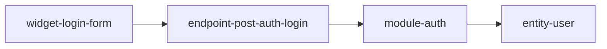

# Cross-linking conventions

The architecture-mapper outputs form a **drillable knowledge base**, not disconnected files. Follow these rules in every file produced under `docs/architecture/`.

## Anchor slugs

Every addressable thing gets a stable kebab-case anchor in its canonical file, declared with Markdown heading IDs (`### Thing name {#slug}`).

| Thing        | Canonical file           | Slug format                         | Example                              |
| ------------ | ------------------------ | ----------------------------------- | ------------------------------------ |
| Module       | `module-map.md`          | `module-{slug}`                     | `module-auth`                        |
| Endpoint     | `entry-points.md`        | `endpoint-{method}-{path-slug}`     | `endpoint-post-api-auth-login`       |
| Entity       | `data-models.md`         | `entity-{name}`                     | `entity-user`                        |
| UI widget    | `ui-surface-map.md`      | `widget-{page}-{name}`              | `widget-dashboard-revenue-card`      |
| Steel thread | `steel-threads.md`       | `thread-{slug}`                     | `thread-user-login`                  |
| Workflow     | `workflows.md`           | `workflow-{slug}`                   | `workflow-order-fulfillment`         |
| Job          | `background-jobs.md`     | `job-{slug}`                        | `job-nightly-reindex`                |
| Integration  | `integrations.md`        | `integration-{slug}`                | `integration-stripe`                 |

## Cross-references in prose

Whenever you mention a thing that has a canonical entry, link to it: `[User entity](./data-models.md#entity-user)` — never a bare name when a link is possible.

## Clickable Mermaid diagrams

Every Mermaid diagram that references addressable things uses the slug as the node ID and emits a `click` directive at the end linking to the canonical file+anchor.

Target: at least 80% of nodes in any diagram that reference addressable things must have a `click` directive. Pure narrative labels (e.g., "User clicks") are exempt.

## Backlinks

Every artifact ends with a `## Backlinks` section listing what else points into it.

## Large-repo handling

- **Sample, don't enumerate** — one or two representative files per folder unless signal warrants depth.
- **Checkpoint into `progress.md`** after each pass.
- **Trust the filesystem as state** — summarize into docs, reload summaries on the next pass.
- **Stop and name the gap** — record opaque areas in `unknowns.md` with evidence.

## CLAUDE.md ownership (when mapping for onboarding)

When writing repo-root `CLAUDE.md` during mapping:

- architecture-mapper owns: stack summary, architecture mission, hunt priorities, cross-link conventions pointer
- `onboard` owns: invariants pointer block, `.topia/contract.md` references, developer-guide pointers

Do not overwrite onboard-owned sections if they already exist.
