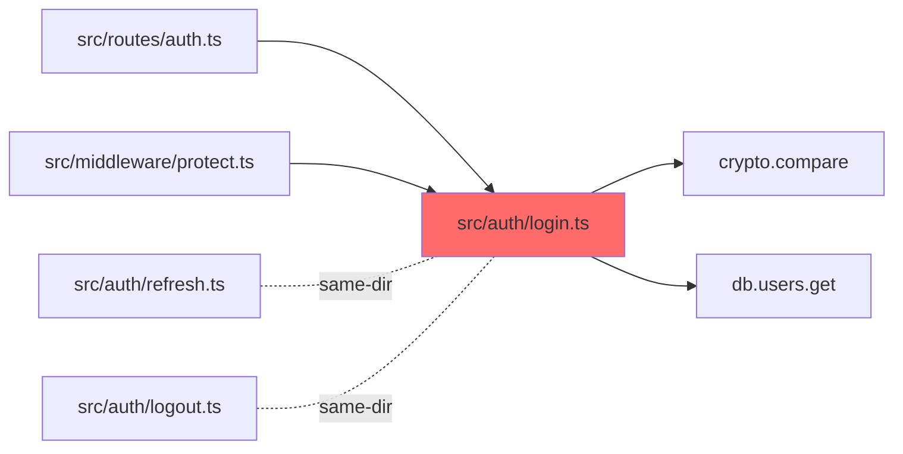

# recon

## Purpose

Fast, lightweight codebase scanning. Recon is the eyes of the Topia ecosystem. Pure read-only — discovers structure, files, patterns, and dependencies so other skills don't have to re-scan.

## Instructions

When invoked, perform these steps:

### Phase 1: Structure Scan

Map the project layout:

1. Use `Glob` with `**/*` to understand directory structure
2. Use `Bash` to run `ls` on key directories (root, src, lib, app)
3. Identify framework by detecting these files:
   - `package.json` → Node.js/TypeScript
   - `Cargo.toml` → Rust
   - `pyproject.toml` / `setup.py` → Python
   - `go.mod` → Go
   - `pom.xml` / `build.gradle` → Java

```
TodoWrite: [
  { content: "Scan project structure", status: "in_progress" },
  { content: "Run targeted file search", status: "pending" },
  { content: "Map dependencies", status: "pending" },
  { content: "Detect conventions", status: "pending" },
  { content: "Generate codebase map (if full scan)", status: "pending" },
  { content: "Generate recon report", status: "pending" }
]
```

### Phase 2: Targeted Search (Search-First)

**Search-first principle**: Before building anything new, recon checks if a solution already exists — in the codebase, in package registries, or in available MCP servers.

**Adopt / Extend / Compose / Build decision matrix**:

When recon finds the caller's target domain, classify the situation:

```
ADOPT     — Exact match exists (in codebase, npm, PyPI, MCP). Use as-is.
EXTEND    — Partial match exists. Extend/configure existing solution.
COMPOSE   — Multiple pieces exist. Wire them together.
BUILD     — Nothing suitable exists. Build from scratch.
```

Report the classification to the calling skill. This informs Phase 2 (PLAN) in build — ADOPT and EXTEND are vastly cheaper than BUILD.

Invoke `topia:neural-memory` (Recall Mode) with 2–3 project-prefixed topics before returning.

**Quick checks before deep search**:
1. `Grep` the codebase for existing implementations of the target functionality
2. Check `package.json` / `pyproject.toml` / `Cargo.toml` for relevant installed packages
3. If the task involves external data/APIs: note available MCP servers that might help

Based on the scan request, run focused searches:

1. Use `Glob` to find files matching the target domain:
   - Auth domain: `**/*auth*`, `**/*login*`, `**/*session*`
   - API domain: `**/*.controller.*`, `**/*.route.*`, `**/*.handler.*`
   - Data domain: `**/*.model.*`, `**/*.schema.*`, `**/*.entity.*`
2. Use `Grep` to search for specific patterns:
   - Function names: `pattern: "function <name>"` or `"def <name>"`
   - Class definitions: `pattern: "class <Name>"`
   - Import statements: `pattern: "import.*<module>"` or `"from <module>"`
3. Use `Read` to examine the most relevant files (max 10 files, prioritize by relevance)

**Verification gate**: At least 1 relevant file found, OR confirm the target does not exist.

#### Info Saturation Detection (Know When to Stop)

Recon's default is "max 10 file reads" — but the real question is whether additional reads are productive. Track saturation across Phase 2 searches:

**Entity tracking**: As you scan files, extract key entities (function names, class names, imports, API endpoints, config keys). Maintain a running set of discovered entities.

| Signal | Threshold | Meaning | Action |
|--------|-----------|---------|--------|
| **New entity ratio** | Last 2 file reads added <2 new entities | Search is exhausted for this domain | STOP scanning, move to Phase 3 |
| **Content similarity** | Last 2 files share >70% of the same imports/patterns | Files are in the same module, redundant reads | Skip remaining files in this directory |
| **Query variation** | 3+ Glob/Grep queries with different patterns all return the same files | All search angles converge | Domain is fully mapped, proceed |

**When saturation detected**: Emit in Recon Report:
```
### Saturation
- Reached after [N] file reads — last 2 reads added [M] new entities
- Recommendation: synthesize_and_report (further scanning unlikely to yield new insights)
```

**Why**: Without saturation detection, recon reads its full budget of 10 files even when 3 files already contain everything needed. This wastes context tokens and delays the calling skill. Early saturation detection returns control faster.

### Phase 3: Dependency Mapping

1. Use `Grep` to find import/require/use statements in identified files
2. Map which modules depend on which (A → imports → B)
3. Identify the blast radius of potential changes: which files import the target file

### Phase 4: Convention Detection

1. Check for config files using `Glob`:
   - `.eslintrc*`, `eslint.config.*` → ESLint rules
   - `tsconfig.json` → TypeScript config
   - `.prettierrc*` → Prettier config
   - `ruff.toml`, `.ruff.toml` → Python linter
2. Check naming conventions by reading 2-3 representative source files
3. Find existing tests with `Glob`: `**/*.test.*`, `**/*.spec.*`, `**/test_*`
4. Determine test framework: `jest.config.*`, `vitest.config.*`, `pytest.ini`

### Phase 4.5: Zoom-Out Mode

Triggered by `mode="zoom-out"` from the caller, OR auto-triggered by listening on `agent.stuck` signal (emitted by `fix` after 2+ failed attempts on the same file, or by `debug` after 3+ disproved hypothesis cycles).

When activated, recon produces a 3-layer ascent map:

| Layer | What it includes | Cap |
|-------|------------------|-----|
| L0 (target) | The stuck file's symbols + immediate imports | unlimited |
| L1 (siblings) | Files in the same directory + their public exports | 8 files |
| L2 (callers/neighbors) | Modules that import L0's exports + neighboring modules in the same domain | 8 modules |

Output is a Mermaid diagram, NOT just a file list — visual is the value-add when an agent is stuck.



**Bounded** — L2 ascent caps at 8 modules. If exceeded, collapse to "showing top 8 by import-frequency". Never blow past the cap silently.

After emitting the map, recon returns to its normal Phase 6 (Generate Report) with the zoom-out section as the primary output.

### Phase 5: Codebase Map (Optional)

When called by `build`, `team`, `onboard`, or `autopsy` (skills that need full project understanding), generate a structured codebase map:

1. Create `.topia/codebase-map.md` with:

```markdown
## Codebase Map
Generated: [timestamp]

### Module Boundaries
| Module | Directory | Public API | Dependencies | Domain |
|--------|-----------|-----------|--------------|--------|
| auth | src/auth/ | login(), logout(), verify() | database, config | Authentication |
| api | src/api/ | routes, middleware | auth, database | HTTP Layer |

### Dependency Graph (Mermaid)
​```mermaid
graph LR
  api --> auth
  api --> database
  auth --> database
  auth --> config
​```

### Domain Ownership
| Domain | Modules | Key Files |
|--------|---------|-----------|
| Authentication | auth, session | src/auth/login.ts, src/auth/verify.ts |
| Data Layer | database, models | src/db/schema.ts, src/models/ |
```

2. Derive modules from directory structure (top-level `src/` subdirectories, or detected framework conventions)
3. Public API = exported functions/classes from each module's index/entry file
4. Dependencies = import statements between modules (from Phase 3)
5. Domain = inferred from module name + file contents (auth, payments, frontend, infra, data, config, etc.)

**Skip this phase** when called by skills that only need targeted search (debug, fix, review, guardian).

### Phase 6: Generate Report

Produce structured output for the calling skill. Update TodoWrite to completed.

## Constraints

- **Read-only**: NEVER use Edit, Write, or Bash with destructive commands. Exception: Phase 5 may write `.topia/codebase-map.md` when called by build, team, onboard, or autopsy
- **Fast**: Max 10 file reads per scan. Prioritize by relevance score
- **Focused**: Only scan what is relevant to the request, not the entire codebase
- **No side effects**: Do not cache, store, or modify anything

## Error Recovery

- If `Glob` returns 0 results: try broader pattern, then report "not found"
- If a file fails to `Read`: skip it, note in report, continue with remaining files
- If project type is ambiguous: check multiple config files, report all candidates

## Calls (outbound)

- `recall` (L3): load prior session context before scanning unfamiliar areas

## Called By (inbound)

- `plan` (L2): scan codebase before planning
- `debug` (L2): find related code for root cause analysis
- `review` (L2): find related code for context during review
- `fix` (L2): understand dependencies before changing code
- `build` (L1): Phase 1 UNDERSTAND — scan codebase
- `team` (L1): understand full project scope
- `guardian` (L2): scan changed files for security issues
- `readiness` (L2): find affected code paths
- `onboard` (L2): full project scan for CLAUDE.md generation
- `autopsy` (L2): comprehensive health assessment
- `surgeon` (L2): scan module before refactoring
- `marketing` (L2): scan codebase for feature descriptions
- `safeguard` (L2): scan module boundaries before adding safety net
- `audit` (L2): Phase 0 project structure and stack discovery
- `db` (L2): find schema and migration files
- `design` (L2): scan UI component library and design tokens
- `perf` (L2): find hotpath files and performance-critical code
- `idea` (L2): scan existing codebase for context before requirements elicitation
- `review-intake` (L2): scan codebase for review context
- `skill-forge` (L2): scan existing skills for patterns when creating new skills
- `idea` (L2): scan existing codebase for context before requirements elicitation
- `retro` (L2): scan commit history and codebase for retrospective analysis
- `integrate` (L2): scan target codebase before integrating code from external repo
- `docs` (L2): scan codebase structure for documentation generation
- `architecture-mapper` (L2): scan entry points, routes, models, jobs before mapping passes
- `logic-guardian` (L2): scan business logic modules for protection mapping
- `adversary` (L2): scan codebase before red-team analysis
- `improve-architecture` (L2): re-scan target module + callers when input context is stale

## Output Format

```
## Recon Report
- **Project**: [name] | **Framework**: [detected] | **Language**: [detected]
- **Files**: [count] | **Test Framework**: [detected]

### Relevant Files
| File | Why Relevant | LOC |
|------|-------------|-----|
| `path/to/file` | [reason] | [lines] |

### Dependencies
- `module-a` → imports → `module-b`

### Conventions
- Naming: [pattern detected]
- File structure: [pattern]
- Test pattern: [pattern]

### Search-First Assessment
- **Classification**: ADOPT | EXTEND | COMPOSE | BUILD
- **Existing solution**: [what was found, if any]
- **Recommendation**: [brief rationale]

### Observations
- [pattern or potential issue noticed]
```

## Returns

| Artifact | Format | Location |
|----------|--------|----------|
| Recon Report | Markdown (inline) | Emitted to calling skill |
| Codebase map | Markdown | `.topia/codebase-map.md` (when called by build, team, onboard, autopsy) |

## Sharp Edges

Known failure modes for this skill. Check these before declaring done.

| Failure Mode | Severity | Mitigation |
|---|---|---|
| Reading all files instead of targeted search (50+ files scanned) | MEDIUM | Max 10 file reads enforced — prioritize by relevance to the caller's domain |
| Reporting "nothing found" without trying a broader pattern | MEDIUM | Try broader glob first (e.g. `**/*auth*` → `**/auth*` → `**/*login*`), then report not found |
| Wrong framework detection affects all downstream planning | HIGH | Check multiple config files; report all candidates if ambiguous, don't guess |
| Missing dependency blast radius in Phase 3 | MEDIUM | Phase 3 is mandatory — callers need to know what else imports the target |

## Done When

- Project structure mapped (directory layout, entry points)
- Framework detected from config files (or "ambiguous" with candidates listed)
- Targeted file search completed for the caller's domain
- Dependency blast radius identified for target files
- Conventions detected (naming, test framework, linting config)
- Codebase map written to `.topia/codebase-map.md` (when called by build, team, onboard, autopsy)
- Recon Report emitted in structured format with Relevant Files table

## Cost Profile

~500-2000 tokens input, ~200-500 tokens output. Always haiku. Cheapest skill in the nexus.

**Scope guardrail**: Do not expand the scan to unrelated modules or write files beyond `.topia/codebase-map.md` unless explicitly delegated by the parent agent.
